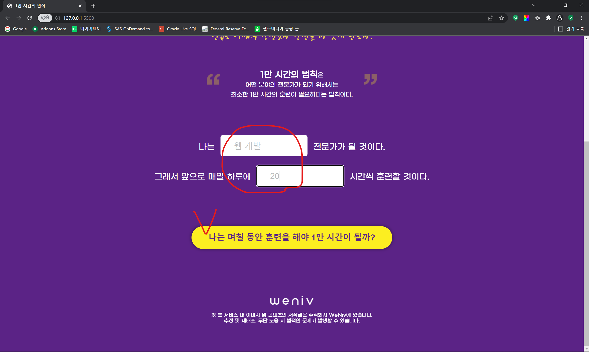
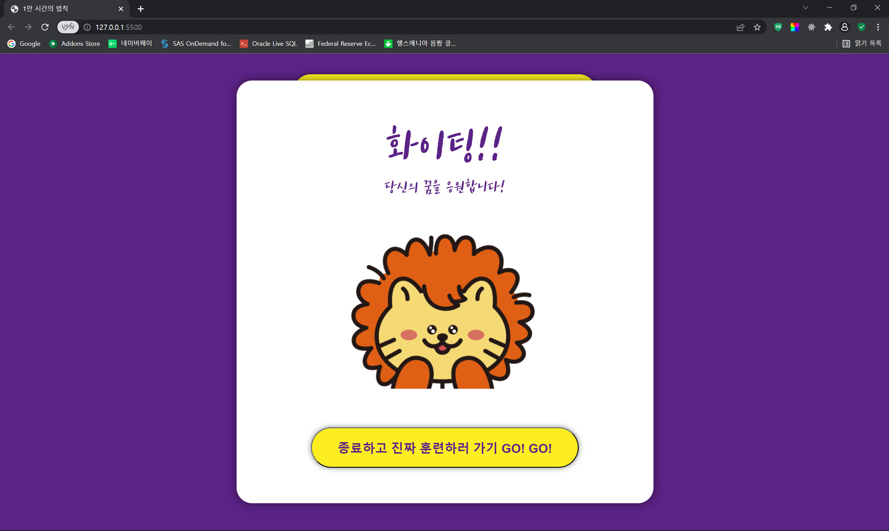

# 1만 시간의 법칙

- ## 주소

  https://yoojs1205.github.io/Law_of_10000_hours/

- ## 사용한 기술 스택

    <div>
    </a>&nbsp;
    </a>&nbsp;
    </a>&nbsp;
    </div><br>

- ## 구현 기능

  1. 버튼 클릭시 결과값 보여주기
  <div align="center">
  
  
  </div>

  ```javascript
  // DOM 요소 변수 저장
  const ToBeInput = document.querySelector(".tobe-input");
  const TimeInput = document.querySelector(".time-input");
  const StartButton = document.querySelector(".start");

  // 값 저장
  var toBe = "";
  var time = 0;

  // 값 설정
  TimeInput.addEventListener("input", (e) => {
    time = e.target.value;
  });

  ToBeInput.addEventListener("input", (e) => {
    toBe = e.target.value;
  });

  // 버튼 클릭 시 값 띄우기
  StartButton.addEventListener("click", () => {
    ResultBox.classList.remove("hidden");
    TimeResult.innerText = Math.round(10000 / time);
    ToBeResult.innerText = toBe;
  });
  ```

  2. 버튼 클릭시 모달창 띄우기 + 모달창이 열려있을 때 외부 스크롤 방지
  <div align="center">
  
  </div>

  ```javascript
  const GoButton = document.querySelector(".go");
  const Modal = document.querySelector(".modal");
  const GoTraining = document.querySelector(".go-training");

  // 버튼 클릭 시 모달창 open + 외부 스크롤 방지
  GoButton.addEventListener("click", () => {
    Modal.classList.toggle("hidden");
    document.body.classList.toggle("no-scroll");
  });

  // 버튼 클릭 시 모달창 close + 외부 스크롤 가능
  GoTraining.addEventListener("click", () => {
    Modal.classList.toggle("hidden");
    document.body.classList.toggle("no-scroll");
  });
  ```

- ## 반응형 구현 (360px)

    <div align="center">
    
    </div>

- ## 개발 이슈
  1. 모바일 친화적인 코드를 짜는 법<br>
     => 반응형을 구현하는데 너무 많은 코드가 추가적으로 필요했다.
  2. input 태그 크기 조정하는법?
